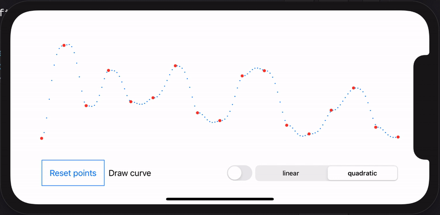

# demo-ios-interpolation-accelerate
Demo project to interpolate CGPoints using Accelerate framework and SwiftUI

For more details about this small project, please check this blog post about [interpolation with Accelerate framework](https://www.vinzius.com/post/how-to-interpolate-with-accelerate-framework-in-swift/).

